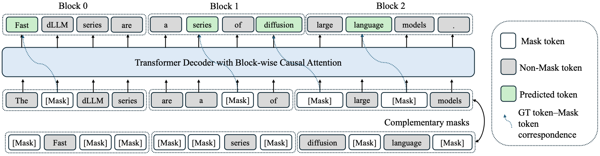
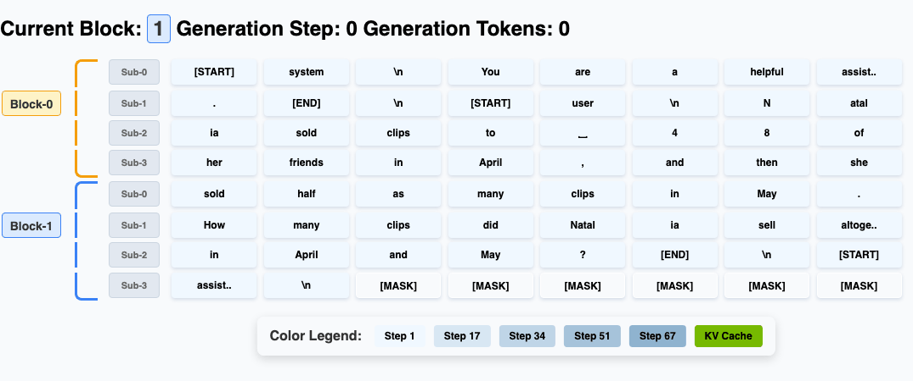
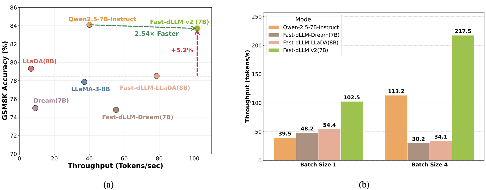
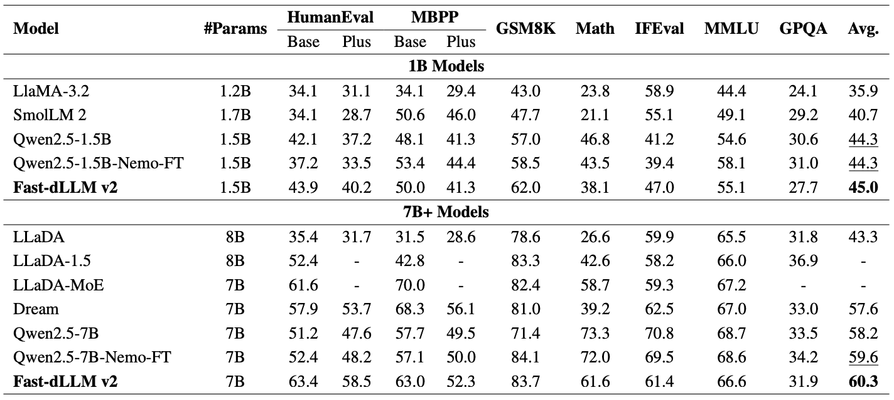

# Fast-dLLM v2: Efficient Block-Diffusion Large Language Model

[](https://nvlabs.github.io/Fast-dLLM/v2)
[](https://arxiv.org/abs/2509.26328)
[](https://huggingface.co/Efficient-Large-Model/Fast_dLLM_v2_7B)

Fast-dLLM v2 is a carefully designed block diffusion language model (dLLM) that efficiently adapts pretrained autoregressive (AR) models into dLLMs for parallel text generation, requiring only approximately 1B tokens of fine-tuning. This represents a **500x reduction** in training data compared to full-attention diffusion LLMs while preserving the original model's performance.

## 🎬 Demo
https://github.com/user-attachments/assets/f2e055f5-3a44-41ca-9ef8-c84cf3ac2951

## 🎯 Key Features

### 1. **Block Diffusion Mechanism**
- Novel training recipe combining block diffusion with complementary attention masks
- Enables blockwise bidirectional context modeling 
- Token shift mechanism to retain autoregressive characteristics

<div align="center">
  
  <p><em>Block-wise causal attention mask and complementary training strategy</em></p>
</div>

### 2. **Hierarchical Caching System**
- **Block-level cache**: Stores historical context representations across blocks
- **Sub-block cache**: Enables efficient parallel generation within partially decoded blocks

### 3. **Parallel Decoding Pipeline**
- Achieves up to **2.5x speedup** over standard AR decoding
- Real-time visualization of the denoising process
- Maintains generation quality while delivering state-of-the-art efficiency

<div align="center">
  
  <p><em>Block-level autoregressive generation with sub-block parallelization</em></p>
</div>

## 🚀 Performance

### Throughput Comparison
Fast-dLLM v2 significantly outperforms baselines in both efficiency and accuracy:
- **2.54× higher throughput** than Qwen2.5-7B-Instruct
- **5.2% accuracy improvement** over Fast-dLLM-LLaDA

<div align="center">
  
  <p><em>Throughput and accuracy comparison across different model variants</em></p>
</div>

### Benchmark Results
Comprehensive evaluation across diverse tasks:

| Model Size    | Model               | HumanEval-Base | HumanEval-Plus | MBPP-Base | MBPP-Plus | GSM8K | Math | IFEval | MMLU | GPQA | Average  |
|---------------|---------------------|----------------|----------------|-----------|-----------|-------|------|--------|------|------|----------|
| **1B-scale**  | Fast-dLLM v2 (1.5B) | 43.9           | 40.2           | 50.0      | 41.3      | 62.0  | 38.1 | 47.0   | 55.1 | 27.7 | **45.0** |
| **7B+ scale** | Fast-dLLM v2 (7B)   | 63.4           | 58.5           | 63.0      | 52.3      | 83.7  | 61.6 | 61.4   | 66.6 | 31.9 | **60.3** |

<div align="center">
  
  <p><em>Comprehensive benchmark comparison across diverse tasks</em></p>
</div>


## 🏋️ Training

### Environment Setup
From the **Fast-dLLM repository root** (the directory that contains `v1/`, `v2/`, etc.), create and activate a prefix conda environment (Python 3.11.10, `pip`, and `ipykernel`—as in the double-backprop `conda create -p` recipe, without the subsequent `pip install -e` lines):

```bash
conda create -p .venv_dllm python=3.11.10 pip ipykernel -y
conda activate ./.venv_dllm
conda install mpi4py -y
```

If conda reports a corrupted package in the default package cache, set a fresh cache for the session, for example `export CONDA_PKGS_DIRS="$PWD/.conda_pkgs_cache"`, and retry the commands above.

### Installation
Install the v2 package in development mode from the `v2` directory:

```bash
cd v2
pip install -e .
```

To run [`eval.py`](eval.py) with **lm-evaluation-harness**, install the optional eval extra (pulls `lm-eval[math,ifeval]==0.4.9`, matching `train_scripts/eval_*.sbatch`):

```bash
pip install -e '.[eval]'
```

### Data Preparation
Download the training data (e.g., Alpaca dataset):

```bash
cd data
bash download.sh alpaca
```

### Fine-tuning
Run the fine-tuning script:

```bash
bash train_scripts/finetune_alpaca.sh
```

This will start the training process using the Alpaca dataset with the optimized block diffusion training recipe.

## 🎮 Quick Start

### Interactive Chatbot
Launch the Gradio-based web interface:

```bash
python app.py
```

This will start a web server at `http://localhost:10086` with:
- Real-time conversation interface
- Live visualization of the denoising process
- Adjustable generation parameters (block size, temperature, threshold)
- Performance metrics display

### Command Line Chat
For a simple command-line interface:

```bash
python run_chatbot.py
```

Commands:
- Type your message and press Enter
- `clear` - Clear conversation history
- `exit` - Quit the chatbot


## 📊 Evaluation

**Current working directory:** `eval.py` and `eval_script.sh` live under `v2/`. Run them **after `cd v2`**, or from the repository root use `accelerate launch v2/eval.py ...` (otherwise you will see `can't open file '.../Fast-dLLM/eval.py'`).

### Run Benchmark Evaluation
Execute the evaluation script for comprehensive benchmarking:

```bash
cd v2   # required so eval_script.sh and eval.py resolve
bash eval_script.sh
```

This script evaluates the model on:
- **MMLU**: Massive Multitask Language Understanding
- **GPQA**: Graduate-level Google-Proof Q&A
- **GSM8K**: Grade School Math 8K
- **Minerva Math**: Mathematical reasoning
- **IFEval**: Instruction following evaluation

### Custom Evaluation
For custom evaluation with specific parameters (from `v2/`):

```bash
cd v2
accelerate launch eval.py \
    --tasks gsm8k \
    --batch_size 32 \
    --num_fewshot 0 \
    --model fast_dllm_v2 \
    --model_args model_path=Efficient-Large-Model/Fast_dLLM_v2_7B,threshold=0.9
```

### Debug evaluation (trajectory + samples on disk)

Use stock lm-eval flags for **how many examples** and **where outputs go**:

- `--limit N` — only the first *N* documents per task (e.g. `1` for a smoke run).
- `--output_path DIR` — results and (with `--log_samples`) per-task sample JSONL under `DIR`.
- `--log_samples` — write detailed sample records (prompts, model outputs, metrics) for inspection.

Use **model_args** for Fast-dLLM-specific console debugging (no Hydra in this repo):

- `debug_print=True` — print partially denoised generation tails to **stderr** during `batch_sample` (rank 0 only).
- `debug_print_prompt=True` — print the question / final decoded answer block to **stdout** after each batch (same as the old always-on prints).

Example (from `v2/`; or use `accelerate launch v2/eval.py` from the repo root):

```bash
cd v2
accelerate launch eval.py \
  --tasks gsm8k \
  --limit 1 \
  --log_samples \
  --batch_size 1 \
  --num_fewshot 0 \
  --confirm_run_unsafe_code \
  --model fast_dllm_v2 \
  --fewshot_as_multiturn \
  --apply_chat_template \
  --output_path eval_results/debug_gsm8k \
  --log_samples \
  --model_args model_path=Efficient-Large-Model/Fast_dLLM_v2_7B,threshold=1,debug_print=True,debug_print_prompt=True
```

MATH-500 smoke (custom task under `scripts/lm_eval_tasks/math500`; chat-template eval):

```bash
python_debug eval.py \
  --tasks math500 \
  --include_path scripts/lm_eval_tasks/math500 \
  --batch_size 1 \
  --num_fewshot 0 \
  --confirm_run_unsafe_code \
  --model fast_dllm_v2 \
  --fewshot_as_multiturn \
  --apply_chat_template \
  --output_path debug_logs/math500__vanilla_1p5B_numina \
  --model_args model_path=/work/pi_mccallum_umass_edu/brozonoyer_umass_edu/Fast-dLLM/v2/output_models/magicoder_oss_full_1p5B/vanilla_nopack1024_bs2x16_ep1_lr1e-5/checkpoint-1000,threshold=0.9,show_speed=True,debug_print=True,debug_print_prompt=True \
  --limit 1 \
  --log_samples
```

HumanEval+ / MBPP+ via lm-eval EvalPlus tasks (`lm_eval_tasks/`; **do not** pass `--apply_chat_template`; set `EVALPLUS_TOKENIZER` to an HF id or tokenizer dir that matches the model):

```bash
# cwd = Fast-dLLM/v2 (same as math500 commands above)
PYTHONPATH="$(pwd)/lib/lm-evalulation-harness:$(pwd)" \
EVALPLUS_TOKENIZER="Efficient-Large-Model/Fast_dLLM_v2_1.5B" \
python_debug eval.py \
  --tasks humaneval_plus_evalplus \
  --include_path lm_eval_tasks \
  --batch_size 1 \
  --num_fewshot 0 \
  --confirm_run_unsafe_code \
  --model fast_dllm_v2 \
  --output_path debug_logs/humaneval_plus_evalplus__smoke \
  --model_args model_path=/work/pi_mccallum_umass_edu/brozonoyer_umass_edu/Fast-dLLM/v2/output_models/magicoder_oss_full_1p5B/vanilla_nopack1024_bs2x16_ep1_lr1e-5/checkpoint-1000,threshold=0.9,show_speed=True,debug_print=True,debug_print_prompt=True \
  --limit 1 \
  --log_samples

python_debug eval.py \
  --tasks mbpp_plus_evalplus \
  --include_path lm_eval_tasks \
  --batch_size 1 \
  --num_fewshot 0 \
  --confirm_run_unsafe_code \
  --model fast_dllm_v2 \
  --output_path debug_logs/mbpp_plus_evalplus__smoke \
  --model_args model_path=/work/pi_mccallum_umass_edu/brozonoyer_umass_edu/Fast-dLLM/v2/output_models/numina_1p5B/vanilla_nopack1024_bs2x16_ep1_lr5e6/checkpoint-600,threshold=0.9,show_speed=True,debug_print=True,debug_print_prompt=True \
  --limit 1 \
  --log_samples
```

## 🏗️ Architecture

### Training Recipe
- **Token Shift Mechanism**: Each masked token is predicted using the logit of its preceding token
- **Block-wise Causal Attention**: Access to all clean tokens from previous blocks and noisy tokens within current block
- **Complementary Masks**: Alternate masking patterns ensure every token position is learned

### Generation Process
1. **Block-level Generation**: Autoregressive at the block level
2. **Sub-block Parallelization**: Parallel decoding within blocks for efficiency
3. **Hierarchical Caching**: Block and sub-block level caching for speed optimization

## 📁 File Structure

```
v2/
├── app.py                    # Gradio web interface
├── run_chatbot.py           # Command-line chatbot
├── eval.py                  # Evaluation harness integration
├── eval_script.sh           # Benchmark evaluation script
├── generation_functions.py  # Core generation algorithms
├── index.html              # Project webpage
├── asset/                  # Visual assets
│   ├── demo.mp4
│   ├── benchmark_results.png
│   ├── throughput.png
│   ├── training_recipe.png
│   └── visualization_animation.gif
└── README.md               # This file
```

## 🎨 Visualization Features

The web interface provides real-time visualization of:
- **Denoising Process**: Watch tokens being unmasked in real-time
- **Generation Progress**: Visual feedback of the generation pipeline
- **Performance Metrics**: Live throughput and timing information
- **Slow Motion Replay**: Detailed step-by-step visualization

## 🔬 Technical Details

### Model Architecture
- Based on Qwen2.5 architecture with block diffusion modifications
- 7B parameter model with efficient parallel decoding capabilities
- Custom attention mechanisms for block-wise processing

### Optimization Techniques
- Block-level KV caching for reduced computation
- Sub-block parallel processing for improved throughput
- Confidence-aware token unmasking for quality preservation

## 🤝 Contributing

We welcome contributions! Please see our [Contributing Guidelines](../CONTRIBUTING.md) for details.

## 📄 License

This project is licensed under the Apache License 2.0. See the [LICENSE](../LICENSE) file for details.

## 📚 Citation

If you find this work useful, please cite our paper:

```bibtex
@misc{wu2025fastdllmv2efficientblockdiffusion,
      title={Fast-dLLM v2: Efficient Block-Diffusion LLM}, 
      author={Chengyue Wu and Hao Zhang and Shuchen Xue and Shizhe Diao and Yonggan Fu and Zhijian Liu and Pavlo Molchanov and Ping Luo and Song Han and Enze Xie},
      year={2025},
      eprint={2509.26328},
      archivePrefix={arXiv},
      primaryClass={cs.CL},
      url={https://arxiv.org/abs/2509.26328}, 
}
```

## 🙏 Acknowledgements

We thank [Qwen2.5](https://github.com/QwenLM/Qwen2.5) for the base model architecture
